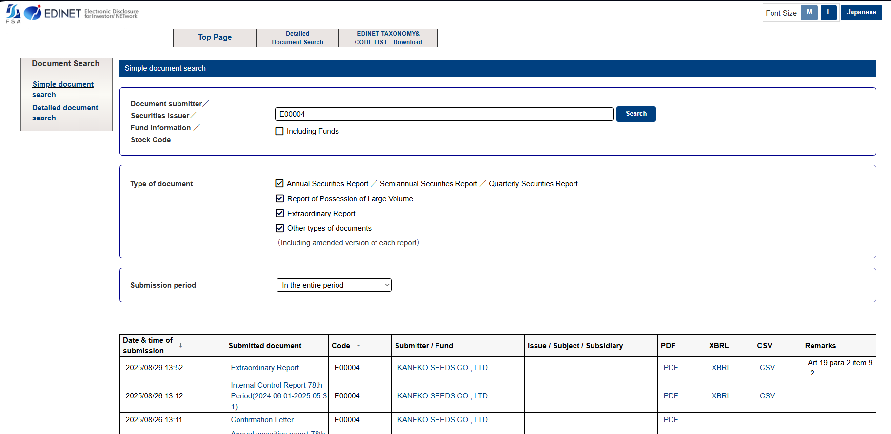

# EDINET Scraper ETL

End-to-end scraper to download public EDINET filings (PDFs and CSVs), persist file metadata to MongoDB, and organize outputs in a portable `data/` layout.

This guide walks you through prerequisites, setup, running, and where to find results.

## Background
EDINET is the Japanese Financial Services Agency’s electronic disclosure system where all publicly listed Japanese companies publish regulated filings and disclosures. Reliable access to, and processing of, this data is crucial for analytical, compliance, and research applications.




## Prerequisites

- Docker and Docker Compose installed
- Optionally, Python 3.11+ and a running MongoDB instance if you plan to run the pipeline locally (without Docker)

## Quick Start (Docker)

1) Clone this repository

```bash
git clone https://github.com/davidedm26/edinet_scraper.git
cd edinet_scraper
```

2) Build and start services

```bash
docker-compose build etl
docker-compose up -d mongodb etl
```

3) Run the pipeline inside the ETL container

```bash
docker-compose exec etl python src/pipeline.py
```

This will:
- Generate or update the EDINET code list file, which contains the EDINET Code for each listed company and serves as the index for scraping.
- Populate or update the `companies` collection in MongoDB.
- Process pending companies by downloading their PDFs and CSVs, then save file metadata and scraping statistics for each processed company.


## Running Locally (without Docker)
> **Note:** MongoDB runs via Docker Compose by default; you must start your own MongoDB instance and override `MONGO_URI`.


1) Create and activate a Python 3.11 environment

On Windows:

```bash
python -m venv .venv
.venv\Scripts\activate
```

On macOS/Linux:

```bash
python3 -m venv .venv
source .venv/bin/activate
```

2) Install dependencies

```bash
pip install -r requirements.txt
```

3) Start your MongoDB instance and set `MONGO_URI` (according to your instance setup) 

On Windows, set the MongoDB URI environment variable :

```bash
set MONGO_URI=mongodb://localhost:27017
```

On macOS/Linux, use:

```bash
export MONGO_URI=mongodb://localhost:27017
```

4) Run the pipeline

```bash
python src/pipeline.py
```

## Data & Metadata
- Downloaded files will be available in the `data/` folder.
- In particular, files are stored under `data/<EDINET_CODE>/<pdf|csv>/<DOCUMENT_TYPE>/...`
- File metadata are stored in MongoDB `files` collection with a unique index on `(document_name, file_type, edinet_code)`
- Companies, their scraping stats and their processing status live in the `companies` collection


## Stats

You can generate aggregate statistics about processed companies and downloaded files using `stats/stats.py`.

Inside Docker (recommended after a pipeline run):

```bash
docker-compose exec etl python src/stats/stats.py
```

Locally (ensure your virtualenv is active and `MONGO_URI` is set):

```bash
python src/stats/stats.py
```

The script queries MongoDB and prints + writes a JSON file at `data/stats_summary.json`:
- Total companies (by status)
- Totals of PDFs/CSVs downloaded / not found / errors
- Aggregate elapsed time and per-second throughput indicators


